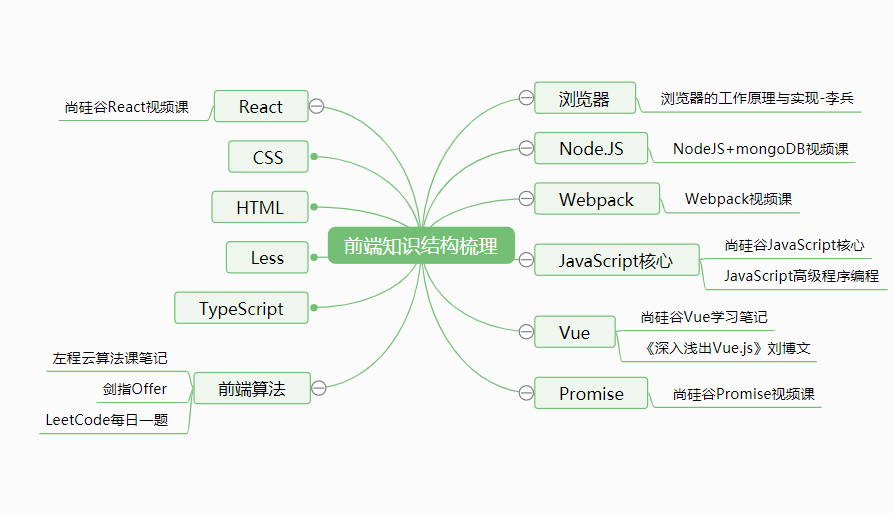

# FKS-Note
Frontend-knowledge-structure-Notes（前端知识结构笔记）

## 一、前端考点总结课程笔记

#### 1、[HTML和CSS](./前端考点总结/一、HTML和CSS.md)

#### 2、[ES](./前端考点总结/二、ES.md)

#### 3、[Web_API](./前端考点总结/三、Web_API.md)

#### 4、[开发环境](./前端考点总结/四、开发环境.md)

#### 5、[运行环境](./前端考点总结/五、运行环境.md)

#### 6、[HTTP_协议](./前端考点总结/六、HTTP_协议.md)

## 二、浏览器工作原理与实现

#### 1、[知识梳理]()

#### 2、[宏观下的浏览器]()

#### 3、[浏览器中的JavaScript执行机制]()

#### 4、[V8工作原理]()

#### 5、[浏览器中的页面循环系统]()

#### 6、[浏览器中的页面](./浏览器工作原理与实现/06-浏览器中的页面.md)

#### 7、[浏览器中的网络]()

#### 8、[浏览器安全]()

## 三、左程云算法课笔记

#### [初级1](./左程云算法笔记/img/Snipaste_2021-03-01_10-36-43.png)

#### [初级2](./左程云算法笔记/img/Snipaste_2021-03-01_10-37-09.png)

#### [初级3](./左程云算法笔记/img/Snipaste_2021-03-01_10-37-44.png)

#### [初级4](./左程云算法笔记/img/Snipaste_2021-03-01_10-37-51.png)

#### [初级5](./左程云算法笔记/img/Snipaste_2021-03-01_10-38-07.png)

#### [初级6](./左程云算法笔记/img/Snipaste_2021-03-01_10-38-30.png)

## 四、NodeJS笔记

#### [01](./NodeJS笔记/01.md)

#### [02](./NodeJS笔记/02.md)

#### [03](./NodeJS笔记/03.md)

## 五、Promise笔记

#### [note](./Promise笔记/note.md)

## 六、React笔记

#### [01_react_笔记](./React笔记/01_react_笔记.md)

#### [02_react案例_笔记](./React笔记/02_react案例_笔记.md)

#### [03_react-router_教程](./React笔记/03_react-router_教程.md)

#### [04_react-UI_教程](./React笔记/04_react-UI_教程.md)

#### [05_redux笔记](./React笔记/05_redux笔记.md)

## 七、Vue笔记

#### [Vue核心1](./Vue笔记/img/Snipaste_2021-03-01_13-48-13.png)

#### [Vue核心2](./Vue笔记/img/Snipaste_2021-03-01_13-49-40.png)

#### [Vue核心3](./Vue笔记/img/Snipaste_2021-03-01_13-49-04.png)

#### [Vue生命周期](./Vue笔记/img/Snipaste_2021-03-01_13-50-12.png)

#### [Vue-cli](./Vue笔记/img/Snipaste_2021-03-01_13-47-00.png)

#### [Vue源码分析](./Vue笔记/img/Snipaste_2021-03-01_13-50-41.png)

## 八、Webpack笔记

## 九、JavaScript核心

#### [变量及数据类型](./JavaScript核心/img/Snipaste_2021-03-01_13-42-52.png)

#### [变量提升与函数提升](./JavaScript核心/img/)

#### [ES6中的语法](./JavaScript核心/img/Snipaste_2021-03-01_13-39-29.png)

#### [原型与原型链](./JavaScript核心/img/Snipaste_2021-03-01_13-41-36.png)

#### [IIFE](./JavaScript核心/img/Snipaste_2021-03-01_13-42-14.png)

## 十、《深入浅出 Vue.js》 

##### [第一章 Vue.js简介]()

##### 第二章 Object的变化侦测

##### 第三章 Array的变化侦测

##### 第四章 变化侦测相关的API实现

##### 第五章 虚拟DOM简介

##### 第六章 VNode

##### 第七章 patch

##### 第八章 模板编译

##### 第九章 解析器

##### 第十章 优化器

##### 第十一章 代码生成器

##### 第十二章 架构设计与项目结构

##### 第十三章 实例方法与全局API的实现原理

##### 第十四章 生命周期

##### 第十五章 指令的奥秘

##### 第十六章 过滤的奥秘

##### 第十七章 最佳实践