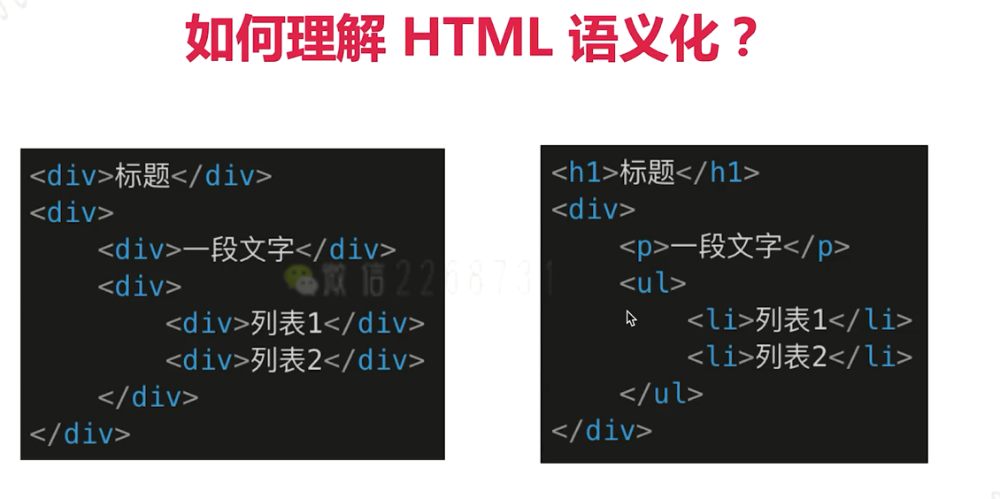
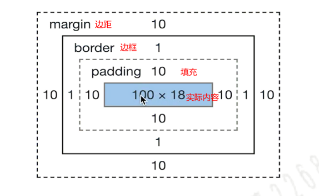
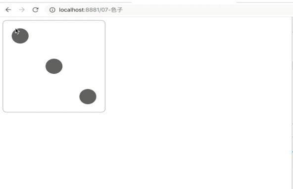

### 一、HTML和CSS

​	HTML前端语义化：就比如我们在写html代码的时候，该用div标签的时候用div标签，改用h标签的时候用h标签，该使用li标签的时候用li标签；不要全用div标签去嵌套实现。



块级元素(display:block/table)：

- div
- h1
- h2
- table
- ul
- ol
- p

内联元素(display:inline/inline-block):

- span 
- img
- input
- button

#### 1、布局-盒模型

##### （1）计算盒模型的宽度

​	offsetWidth = (内容宽度+内边距+边框)，无外边距



```javascript
//如下代码，请问div1的offsetWidth是多大？122px
<!--
(1)CSS盒模型本质上是一个盒子，封装周围的HTML元素，它包括：边距，边框，填充，和实际内容。
(2)盒模型允许我们在其它元素和周围元素边框之间的空间放置元素。
-->
<style>
    #div1{
        width:100px;
        padding:10px;
        border:1px soild #ccc;
        margin:10px;
        //box-sizing:border-box;不加的话内容边距是100px,加了的话总体边距是100px
    }
</style>
<div id="div1">
</div>
```

##### （2）margin纵向重叠的问题

```javascript
<!--
如下代码，AAA和BBB之间的距离是多少?
    相邻元素的margin-top和margin-bottom会发生重叠
    空白内容的<p></p>也会重叠
    答案：15px;
-->
<style>
    p{
         font-size:16px;
        line-height:1;
        margin-top:10px;
        margin-bottom:15px;
    }
</style>
<p>AAA</p>
<p></p>
<p></p>
<p></p>
<p>BBB</p>
```

##### （3）margin负值的问题

​	对margin的top left right bottom设置负值：

- margin-top和margin-left负值，元素向上、向左移动
- margin-right负值，右侧元素左移，自身不受影响
- margin-bottom负值，下方元素上移，自身不受影响

#### 2、布局-BFC

##### （1）BFC的理解和应用

​	BFC即块级格式化上下文，它是一个独立的块级渲染容器，拥有自己的渲染规则，不受外部影响，不影响外部特征。

​	BFC常见用法：清除浮动

```JavaScript
.bfc {
    overflow:hidden;/*触发元素 BFC*/
}
```

##### （2）形成条件

- float不是none
- position是absolute或fixed
- overflow不是visible 
- display是flex inline- block等

#### 3、布局-float

##### （1）双飞翼布局和圣杯布局

圣杯布局和双飞翼布局的目的：

- 三栏布局，中间一栏最先加载和渲染（内容最重要） ；
- 两侧内容固定，中间内容随着宽度自适应 ；
- 一般适用于PC网页；

总结：

- 使用float布局；
- 两侧使用margin负值，以便和中间内容横向重叠；
- 防止中间内容被两侧覆盖，一个用padding一个用margin；

对比：

- 圣杯布局是通过padding来为左右留白的；
- 双飞翼布局是通过margin来为左右留白的；

##### （2）手写双飞翼布局

```javascript
<style>
#center {
    float: left;
    width: 100%;
    /*左栏上去到第一行*/
    height: 100px;
    background: blue;
}
#left {
    float: left;
    width: 180px;
    height: 100px;
    margin-left: -100%;
    background: #0c9;
}
#right {
    float: left;
    width: 200px;
    height: 100px;
    margin-left: -200px;
    background: #0c9;
}

/*给内部div添加margin，把内容放到中间栏，其实整个背景还是100%*/
#inside {
    margin: 0 200px 0 180px;
    height: 100px;
}
</style>
<body>
    <div id="center">
        <div id="inside">middle</div>
    </div>
    <div id="left">left</div>
    <div id="right">right</div>
</body>
```

##### （3）手写圣杯布局

```javascript
<style>
#bd{
    padding: 0 200px 0 180px;
    height: 100px;
}
#middle{
    float: left;
    width: 100%;
    height: 500px;
    background:blue;
}
#left{
    float:left;
    width:180px;
    height:500px;
    margin-left:-100%;
    background: #0c9;
    position: relative;
    left: -180px;
}
#right{
    float: left;
    width: 200px;
    height: 500px;
    margin-left: -200px;
    background: #0c9;
    position: relative;
    right: -200px;
}
</style>
<body>
    <div id="bd">
        <div id="middle">middle</div>
        <div id="left">left</div>
        <div id="right">right</div>
    </div>
</body>
```

##### （4）手写clearfix

```JavaScript
.clearfix:after{
    content:'';
    display:table;
    clear:both;
}
.clearfix{
    *zoom:1; /*兼容IE低版本*/
}
```

#### 5、布局-flex

##### （1）基础知识

1. flex-direction，属性决定主轴的方向（即项目的排列方向）；
2. flex-wrap属性定义，如果一条轴线排不下，如何换行；
3. flex-flow属性是flex-direction属性和flex-wrap属性的简写形式，默认值为row nowrap；
4. justify-content属性定义了项目在主轴上的对齐方式；
5. align-items属性定义项目在交叉轴上如何对齐；
6. align-content属性定义了多根轴线的对齐方式。如果项目只有一根轴线，该属性不起作用；

##### （2）flex实现三点骰子

```JavaScript
/*flex 画三个点的骰子*/
.box {
    display:flex;   /*flex 布局*/
    justify-content:space-between;  /*两端对齐*/
}
.item{
    /*背景色、大小、边框等*/
}
.item:nth-child(2){
    align-self:center;/*第二项居中对齐*/
}
.item:nth-child(3){
    align-self:flex-end;/*第三项尾对齐*/
}
```



#### 6、定位

##### （1）absolute和relative

- relative 依据自身定位；
- absolute依据最近的一层元素定位： 定位元素，先找absolute relative fixed来定位，如果没有再找body；

##### （2）居中对齐的实现方式

水平居中：

- inline元素：text-align:center； 
- block元素：margin:auto；
- absolute元素：left:50% + margin-left 负值；

垂直居中：

- inline元素：line-height的值等于height值；
- absolute元素：top:50% + margin-top负值；
- absolute元素：transform : translate(-50%,-50%)；
- absolute元素：top，left，bottom，right = 0 + margin：auto；

#### 7、图文样式

line-height继承问题：

1. 如果写的是具体数值，如30px,则继承该值；
2. 如果写成2/1.5，则继承该比例，如果标签本身有大小或者高度：比例 x高度；
3. 写百分比，如200%，则继承计算出来的值；

```javascript
<!--如下代码，p 标签的行高将会是多少？-->   答案：40px
<style>
    body{
        font-size:20px;
        line-height:200%;
    }
    p{
        font-size:16px;
    }
</style>
<body>
    <p>AAA</p>
</body>
```

#### 8、移动端响应式

常用长度单位总结：

- px,绝对长度单位，最常用；
- em,相对长度单位，相对于父元素，不常用；
- rem,相对长度单位，相对于根元素，常用于响应式布局；

响应式布局常用方案：

- media-query，根据不同的屏幕宽度设置根元素font-size；
- rem，基于根元素的相对单位；

##### （1）rem

```javascript
html{
    font-size:100px;
}
div{
    background-color:#ccc;
    margin-top:10px;
    font-size:0.16rem;  //100px x 0.16
}
//rem的弊端：阶梯性
```

##### （2）vm/vh

网页视口尺寸： 

- window.screen.height //屏幕高度
- window.innerHeight //网页视口高度 
- document.body.clientHeight //body高度

vm/vh：

- vh网页视口高度的1/100
- vm网页视口高度的1/100
- vmax取两者最大值；vmin取两者最小值；

#### 9、动画/渐变

##### （1）CSS3动画
