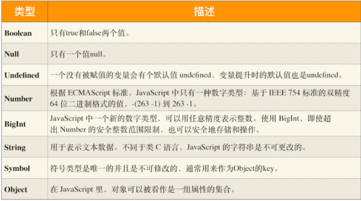
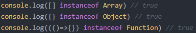
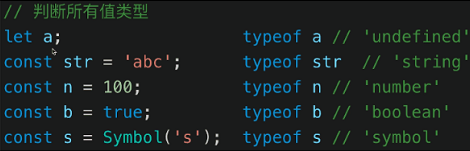
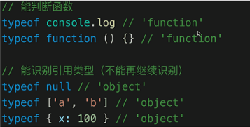
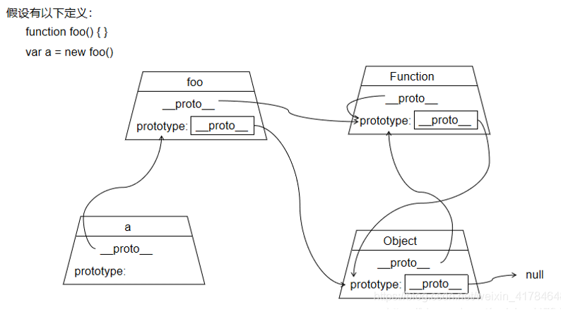
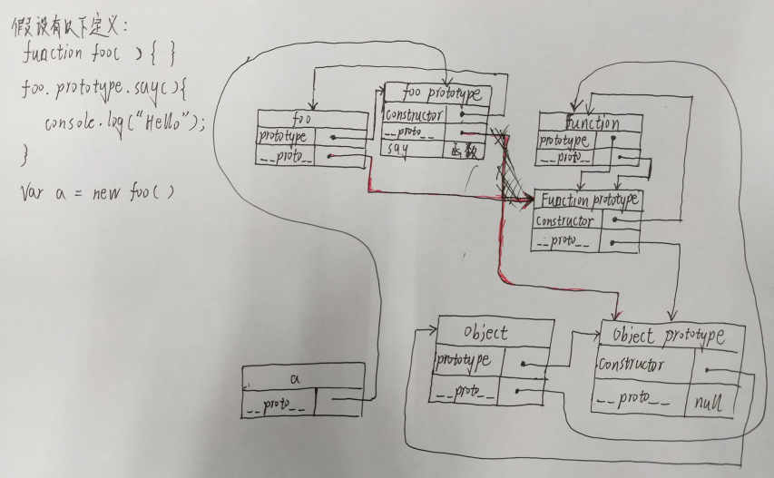
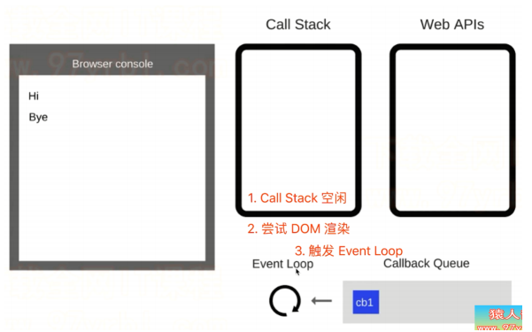

### 二、ES

#### 1、函数式编程思想

​	(1) "函数式编程"是一种 "编程范式" ,它属于["结构化编程"](http://en.wikipedia.org/wiki/Structured_programming)的一种，主要思想是把运算过程尽量写成一系列嵌套的函数调用。

​	(2) 函数式编程的一个特点就是，允许把函数本身作为参数传入另一个函数，还允许返回一个函数！

​	(3) 函数式编程大量使用函数，减少代码的重复，因此程序比较短，开发比较快；通过定义不同功能的函数，可以模块化代码，实现函数功能的复用，降低代码的耦合性，有利于合作开发代码；函数式编程不需要考虑"死锁"，因为它不修改变量，所以根本不存在"锁"线程的问题。不必担心一个线程的数据，被另一个线程修改；

​	(4) <https://www.ruanyifeng.com/blog/2012/04/functional_programming.html>

#### 2、变量类型

 JavaScript 中的数据类型一共有 8 种，它们分别是：



##### （1）七大基本类型：

​	number、null、undefined、boolean、string、Symbol(ES6)、BigInt

##### （2）引用类型：

​	数组(Array)、对象(Object)、Date、函数（Function）

##### （3）null和undefined的区别

- null会被转换成0，表示此处没有对象不应该有值。典型用法：如原型链最顶端
- undefined转为NAN，此处应该有一个值但是还没有定义。典型用法：如变量被声明了但是没有赋值。
- typeof null返回的是‘Obejct’

##### （4）类型转换

```
const b = 100+'10' //'1001'
```

#### 3、类型判断

##### （1）instanceof(主要用于检测引用类型)

1. ​	instanceof返回的结果是一个布尔值，true或者false。通常用于用于检测引用类型。

   如：‘abc’ instanceof String

2. ​    **instanceof能识别哪些类型**

   - Array

   - Function

   - Object

   - 注意：XXX instanceof Object，如果XXX是Array或者Function，则返回的值是true

     

##### （2）typeof

1. ​	typeof所有返回值都是string类型的。
2. ​	**typeof能识别哪些类型：**

- 识别所有值类型：undefined、string、number、boolean、symbol （值类型）

- 识别函数：function

- 能判断是否是引用类型（但不可再细分）：object（注意：typeof null === 'object'、typeof  array === 'object'、typeof Object === 'object'）

  

  

##### （3）===和==

​	双等判断的是自动转换后是否相等：

- 100 == '100' //true

- 0 == ' ' //true

- 0 == false //true

- false == ' ' //true

- null == undefined //true

  <font color=#FF0000 >所以，所以通常情况下判断它是不是null或undefined的时候用== ，其余的都用===</font>

#### 4、深拷贝和浅拷贝

​	浅拷贝只复制指向某个对象的指针，而不复制对象本身，新旧对象还是共享同一块内存。但是深拷贝会另外创造一个一模一样的对象，新对象跟原对象不共享内存，修改新对象不会改到原对象。

##### （1）浅拷贝的实现方法：

1. 简单地赋值语句
2. Object.assign(target,....source)	（是ES6中的新语法，返回目标对象）
3. js中数组和对象自带的拷贝方法，contact、slice、...展开运算符

##### （2）深拷贝的实现方法：

1. 手动复制：把对象的属性赋值给另一个对象的属性
2. 对象只有一层的话可以使用Object.assign({},obj1)
3. 使用Object.create()  : var newObj = Object.create(oldObj)
4. jquery中使用$.extend
5. loadsh中使用_.cloneDeep

##### （3）递归实现深拷贝：

```JavaScript
function deepClone(obj){
    if(typeof obj !='object' || obj == null ){
        return obj;
    }
    let result;
    if(obj instanceof Array){
        result =[];
    }else{
        result = {};
    }
    for(let key in obj){
        if(obj.hasOwnPreperty(key)){
            result[key] = deepClone(obj[key]);
        }
    }
    return result;
}
```

#### 5、原型和原型链

​	**显示原型**：prototype

- 每个class/函数都有显示原型prototype，它默认指向一个Object空对象（即称为原型对象）
- 原型对象中一个属性constructor，它指向函数对象

​	**隐式原型**：__proto__

- 每个实例都有隐式原型__proto__
- 实例的__proto__指向对应的class/函数的prototype。

（1）Function是所有函数(function)的父亲，所有函数都是它的实例。

（2）Object也是一个函数，所以Object是Function的实例对象。

（3）任何对象的原型链顶端最终都指向Object.prototype,Object.prototype再往上已经没有东西了，所以指向null。

（4）Function比较特殊它的原型指向自己，即Function.__proto__ === Function.prototype。

（5）同时，Function是对象，由(3)可知Function必然有一个地方（即Function.prototype.__proto__）指向Object.prototype。

**先来看一个简化版的原型链图：**



再来看一个完整版的：




<font color='red'>总之，记住一句话：A是B的实例，则A.__ proto __  === B.prototype；只要A是对象，那么A.prototype.__ proto__ 就指向Object.prototype；prototype中的constructor指向的是自己；</font>

https://blog.csdn.net/weixin_41784648/article/details/108252962?spm=1001.2014.3001.5501

#### 6、作用域和闭包

##### （1）作用域

​	ES5中的作用域有---全局作用域、函数作用域

​	ES6中新增了---块级作用域（块级作用域由{}包裹，if语句、for语句中的{}也属于块级作用域）

**var：**

1. 没有块级作用域的概念
2. 有全局作用域、函数作用域的概念
3. 不初始化值默认为undefined
4. 存在变量提升
5. 全局作用域用var声明的变量会挂载到window对象下
6. 同一作用域中允许重复声明

**let：**

1. 有块级作用域的概念
2. 不存在变量提升
3. 暂时性死区，即在块级作用域中，使用let命令声明变量之前，该变量都是不可用的。这在语法上，称为“暂时性死区”（temporal dead zone，简称 TDZ）。
4. 不存在全局作用域的概念
5. 同一块作用域中不允许重复声明

**const:** 

1. 与let特性一样，仅有2个差别。

2. 区别1——必须立即初始化，不能留到以后赋值。

3. 区别2——常量的值不能改变。

   参考：<https://www.cnblogs.com/liu-di/p/11889683.html>

**自由变量：**

​	一个变量在当前作用域没有定义，但是被使用了，它会向上级作用域一层一层一次寻找，直到找到为止，如果到了全局作用域都没有找到，则会报错xx is not defined

##### （2）闭包

​	原理：当一个嵌套的内部函数引用了嵌套的外部函数的数据时，就会产生闭包。

​	作用：方便上下文的局部变量，有利于封装，且方便隐藏数据。

​	缺点：因为内存不会被及时释放，容易造成内存泄漏。

​	解决方法: 在调用完成后给函数赋值为null。

​	<font color=#FF0000 >考闭包输出时，输出看函数定义，不看函数调用</font>

#### 7、继承

##### （1）ES5的继承

​	**构造函数继承**

```javascript
function Parent(){
    this.name = 'parent';
}
Parent.prototype.say = function(){
    console.log('hahha')
}
function Son(age){
    Parent.call(this);
    this.age = age;
}
var p = new Parent();
var s = new Son(21);
p.name  //parent
p.say()  //hahha
s.name //parent
s.age  //21
s.say()  //undefined
/*
    say是Parent原型链上的方法，Parent对象调用方法时，
    如果自身不存在就回去原型链上寻找，在原型链上找到了say方法，
    而Son对象没有继承Parent对象的原型链，所以它在向上寻找时就找不到，
    输出undifined。
*/
```

​	**原型链继承**

```javascript
function Parent(){
    this.name='parent';
    this.arr = [1,2,3,4];
}
Parent.prototype.say = function(){
    console.log('hahah')
}
function Son(age){
    this.age = age;
}
Son.prototype = new Parent();
var s = new Son(23);
var s1 = new Son(23);
var p = new Parent()
s.name  //parent
s.say() //hahah
s.age   //23
s.arr.push(5)  //[1,2,3,4,5]
s1.arr   //[1,2,3,4,5]
/*
原型链继承是直接让Son构造函数的prototype直接指向Parent对象，
这样Parent的东西Son对象可以直接从它的原型链上找到。
缺点就是：当创建多个实例时，如果不同实例可能互相存在影响
*/
```

​	**构造函数+原型链继承**

```javascript
function Parent(){
    this.name = 'parent';
    this.arr = [1,2,3,4];
}
Parent.prototype.say = function(){
    console.log('hahah');
}
function Son(age){
    Parent.call(this);
    this.age = age;
}
Son.prototype = new Parent();
Son.Prototype.constructor = Son;
var s = new Son(20);
var s1 = new Son(20);
var p = new Parent();
s.name  //'parent'
s.age  //20
s.say()  //hahah
s.arr.push(5); //arr[1,2,3,4,5]
s1.arr  //arr[1,2,3,4]
```

##### （2）ES6的继承

```javascript
class Parent{
    constructor(name){
        this.name = name;
    }
    say(){
        console.log('hha');
    }
}
class Son extends Parent{
    constructor(age,name){
        super(name);
        this.age = age;
    }
}
var s = new Son(21,'parent');
s.name  //parent
s.age  //21
s.say()  //hha
```

#### 8、this

##### （1）改变this指向的方法

1. **通过使用call()和apply()**

   call(): 第一个参数表示要把this指向的新目标，第二个之后的参数其实相当于传参，参数以逗号隔开（性能较apply略好）。

   用法：a.call(b,1,2)；表示要把a函数的this指向修改为b的this指向，并运行a函数，传入参数是（1,2）。

   apply()：第一个参数同上，第二个参数接收一个数组，里面也是传参，只是以数组的方式，相当于arguments。

   用法：a.apply(b,[1,2])；表示要把a函数的this指向修改为b的this指向，并运行a函数，传进去的参数是(1,2)。

   *注意：即使只有一个参数的话，也要是数组的形式。

   ```javascript
   //call 的传参和apply的传参
   function say(arg1,arg2){
     console.log(this.name,arg1,arg2);
   };
   var obj = {
     name : 'tom',
     say : function(){
       console.log(this.name);
     }
   }
   say.call(obj,'one','two');//tom one two
   say.spply(obj,['one','two']);//tom one two  效果一样
   ```

2. **通过使用bind()方法**

   作用：bind()方法会创建一个新的函数，称为绑定函数，当调用这个绑定函数时，绑定函数会以创建它时传入bind()方法的第一个参数作为this，传入bind()的第二个及以后的参数加上绑定函数运行时本身的参数按照顺序作为原函数的参数来调用原函数。

   用法：

   ```javascript
   var foo = {
       bar : 1,
       eventBind: function(){
           $('.someClass').on('click',function(event) {
               /* Act on the event */
               console.log(this.bar);      //1
           }.bind(this));//这里的this是eventBind的this，即指向的是foo
       }
   }
   ```

   bind 是返回<font color='red'>对应函数</font>，便于稍后调用；apply 、call 则是<font color='red'>立即调用 </font>>。

   手写bind()函数:

   ```javascript
   Function.prototype.bind_copy = function(){
       //将参数拆分为数组
       const args =Array.prototype.slice.call(arguments)
       //获取this的第一项参数
       const t = args.shift();
       const self = this
       //返回一个函数
       return function(){
           return self.apply(t,args);
       }
   }
   ```

3. **通过new一个对象**

   new的运行原理：

   ```javascript
   new Animal('cat') = {//类似这样
       var obj = {};//先定义一个空对象
       obj.__proto__ = Animal.prototype;
       //把 obj 的__proto__ 指向构造函数 Animal 的原型对象 prototype，
       //此时便建立了 obj 对象的原型链：
       //obj->Animal.prototype->Object.prototype->null
       var result = Animal.call(obj,"cat");//改变this指向，从Animal改变到obj上
       return typeof result === 'object'? result : obj; //返回
   }
   ```

   用法：

   ```javascript
   function Fn(){
       this.user = "追梦子";
   }
   var a = new Fn();//this指向a
   console.log(a.user); //追梦子
   ```

4. **通过return返回**

   在构造函数的时候，使用return进行返回一个Object的时候，当去new一个实例对象的时候，会将this指向改变为return的Object；

   ```javascript
   function fn()  
   {  
       this.user = '追梦子';  
       return {
           "user" : "111"
       };  
   }
   var a = new fn;  
   console.log(a.user); //111
   ```

   参考：https://www.cnblogs.com/web-chuan/p/9096356.html

##### （2）如何判断this的指向

​	<font color='red'>this在各个场景中取什么样的值，是在函数执行的时候确定的，不是在定义的时候确定的。</font>

1. 直接使用的函数this指向window

   ```javascript
   function a(){
   	var user= "呵呵"，
       console.log(this.user),
       console.log(this),
   }
   a();
   // undefined
   // window
   ```

2. 谁调用的函数this就指向谁

   ```javascript
   function o(){
   	var user = "呵呵"，
       fn：function(){
       	console.log(this.user);
       }
   }
   o.fn()
   // 呵呵
   ```

3. this指向最后一个调用它的对象

   ```javascript
   var o={
   	a:10,
       b:{
       	a=12,
           fn:function(){
               console.log(this.a)
           }
       }
   }
   o.b.fn()
   //12
   ```

4. this 永远指向最后调用它的对象

   ```javascript
   var o = {
   	a:10,
       b:{
       	a:12
           fn:function(){
       		console.log(this.a);
           	console.log(this);
       	}
       }
   }
   var j = o.b.fn;
   j();
   // undefined
   //window
   ```

5. 构造函数中的this指向

   ```javascript
   function Fn(){
   	this.user = '呵呵'
   }
   var p = new Fn()
   console.log(p.user) // 
   ```

6. 当this遇到return时

   ```javascript
   function fn(){
   	this.user = "呵呵"
       return {}
   }
   var a = new fn()
   console.log(a.user) //undefined
   ==============================
   function fn(){
   	this.user = "呵呵"
       return function(){}
   }
   var a = new fn()
   console.log(a.user) //undefined
   ==============================
   function fn(){
   	this.user = "呵呵"
       return 1
   }
   var a = new fn()
   console.log(a.user) //呵呵
   ==============================
   function fn(){
   	this.user = "呵呵"
       return undefined
   }
   var a = new fn()
   console.log(a.user) //呵呵
   /*
   如果返回值是一个对象，那么this指向的是构造函数的实例但是并没有被返回，如果返回值
   不是一个对象，那么this还是指向构造函数创建的实例
   */
   ```

7. 箭头函数中的this指向

   ```javascript
   /*箭头函数是ES6中的特性，最重要的特点是他会捕获其所在上下文的this作为自己的this，
   或者说箭头函数本身并没有this，它会沿用外部环境的this。也就是说，箭头函数内部与外部
   的this是保持一致的。
   */
   this.a = 20
   var test = {
   	a:40,
       init:()=>{
           console.log(this.a)
           function go(){
           	this.a = 60
               console.log(this.a)
           }
           go.prototype.a = 50
           return go
       }
   }
   var p = test.init()
   p()
   new (test.init())()
   //20、60、60、60
   this.a = 20
   var test = {
   	a:40,
       init:function(){
       	console.log(this.a)
           function go(){
           	this.a = 60
               console.log(this.a)
           }
           go.prototype.a = 50
           return go
       }
   }
   var p = test.init()
   p()
   new (test.init())()
   //40、60、40、60
   ```

参考：https://segmentfault.com/a/1190000012362141

#### 9、new一个对象的过程

1、创建一个空对象：

```javascript
var obj = new Object() 
```

2、让函数的this指针指向这个对象，并执行函数：

```javascript
var result = Person.call(obj) 
```

3、设置原型链，将该对象的__proto__指向该函数的对象的prototype成员对象。

```javascript
obj.__proto__ = Person.prototype 
```

4、判断函数的返回值类型，如果是值类型则直接返回obj，如果是引用类型则返回该引用类型的对象

#### 10、异步和单线程

​	JS是单线程语言，只能同时做一件事，浏览器和nodejs已经支持启动多进程，如Web Worker。JS和DOM渲染共用的一个线程时，因为JS可修改DOM结构，且遇到等待时（如网络请求，定时任务）不能卡住，所以我们需要异步。异步是基于Callback函数形式的调用，异步不会阻塞代码的执行，而同步会阻塞代码的执行。

#### 11、Callback hell和Promise

​	由于传统的回调函数都是一层一层的嵌套调用，非常容易引起Callback hell(回调地域)，所以Promise应运而生。Promise通过then()或catch()的形式链式调用，避免了回调地域的情况。

##### （1）Promise

​	promise的三种状态：pending、resolved、rejected

​	pending表示事件正在处理中，resolved表示成功状态，rejected表示失败状态；状态从pending到resolved或者rejected的过程是不可逆的；resolved会触发then()的回调，成功触发之后还是resolved的状态，rejected()会触发catch()回调，成功触发之后也是resovled状态。

​	手写promise加载图片：

```javascript
function loadImg(src){
    const p = new Promise{
        (resolve,reject)=>{
            const img= document.createElement('img');
            img.onload = ()=>{
                resolve(img);
            }
            img.onerror=()=>{
                const err = new Error(`图片加载失败${src}`)
                reject(err);
            }
            img.src = src
        }
    }
    return p
}
```

#### 12、async/await

##### （1）async/await和Promise的关系

​	async/await是消灭异步回调的终极武器(从语法上解决了回调的问题，可以通过同步的写法写异步的代码),但和Promise并不互斥，反而两者是相辅相成。

​	执行async函数，返回的是Promise对象，await相当于Promise的then,try....catch可捕获异常，代替了Promise的catch。

​	await必须写在async函数中。

```javascript
async function async1(){
    console.log('async1 start');
    await async2();
    console.log('async1 end');
}
async function async2(){
    console.log('async2');
}
console.log('script satrt');
setTimeout(function(){
    console.log('setTimeout');
},0);
async1();
new Promise(function(resolve){
    console.log('promise1');
    resolve();
}).then(function(){
    console.log('promise2');
});
console.log('script end');
/*
script satrt
async1 start
async2
promise1
script end
async1 end
promise2
setTimeout
*/
```

##### （2）for...of

- for....in(以及forEach for )是常规的同步遍历

- for...of常用于异步的遍历

  ```javascript
  //nums =[1,2,3]
  //函数muti的功能为num*num
  async function(){
      for(let i of nums){
          const res await muti(i);
          console.log(res)
      }
  }
  ```

#### 13、宏任务/微任务

##### （1）什么是宏任务/微任务

​	在ES6规范中，把macrotask称为宏任务microtask称为微任务，宏任务存放在宏队列中，微任务放在微队列中，微任务在宏任务之前执行。

​	宏任务有：setTimeout、setInterval、Ajax、DOM事件等。

​	微任务有：Promise、async/await等。

##### （2）相关面试题

```javascript
console.log(1);
setTimeout(()=>{
	console.log(2);
	Promise.resolve().then(()=>{
		console.log(3);
	});
});
new Promise((resolve,reject)=>{
	console.log(4);
	resolve(5)
}).then((data)=>{
	console.log(data);
})
setTimeout(()=>{
	console.log(6);
})
console.log(7);
//输出:1、4、7、5、2、3、6
```

#### 14、event-loop

##### （1）JS的执行过程

​	JS是单线程的，而且和DOM渲染共用一个线程，JS执行的时候，得 留一些时机供DOM渲染。每次Call stack 清空（即每次轮询结束），即同步代码执行完。都是 DOM重新渲染的机会，DOM结构如有改变则重新渲染。然后再去触发 下一次Event Loop。



##### （2）浏览器中的event loop

​	event-loop即事件循环机制，执行过程如下：

​	1、JS执行全局的同步代码，执行完后Call Stack(调用栈)会被清空。

​	2、从微队列中取出位于队首的回调任务放到调用栈中执行，执行完后再取再执行直到微任务队列为空。如果执行过程中又有微任务产生，那么会将这个微任务加入到该队列的队尾，也会在这个周期被调用执行。

​	3、取出位于宏队列队首的宏任务，放入调用栈中执行。

​	4、重复2-3步骤。

##### （3）NodeJs中的Event Loop机制

​	与浏览器的Event  Loop的区别是Node会将该阶段的宏任务全部执行完。

#### 15、模块化

##### （1）ES6模块化

##### （2）CommonJS模块化