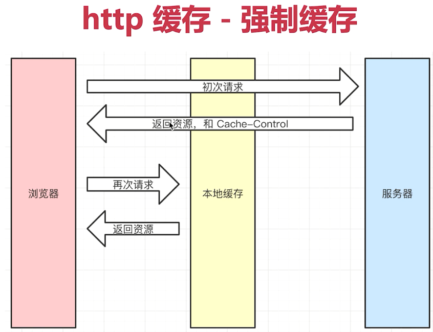
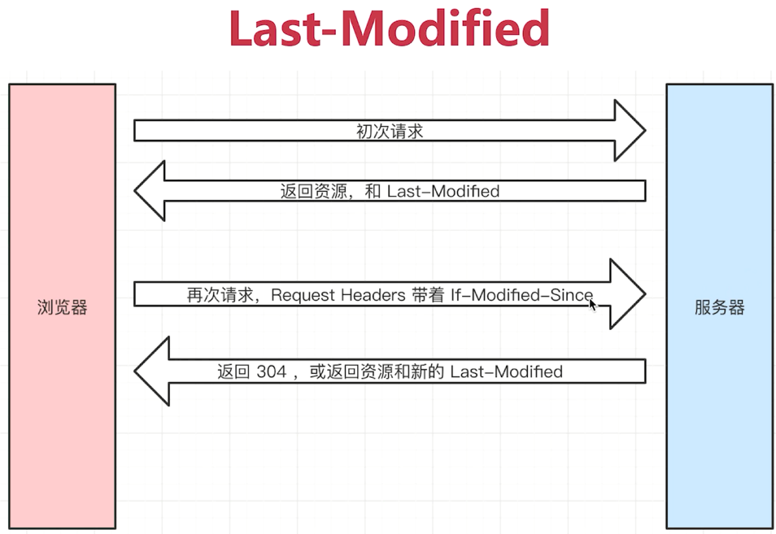
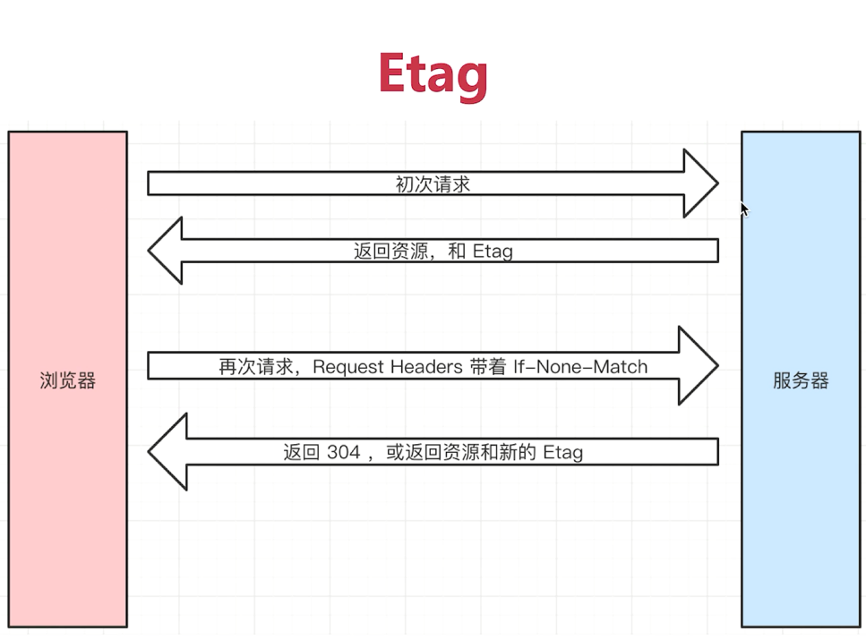

**1、常用的状态码**

1xx：信息性状态码

2xx：响应成功状态码

3xx：重定向状态码

4xx：客户端错误状态码

5xx：服务器端错误状态码

100-199：信息性状态码，表示正在处理请求

200：请求响应成功

204：请求响应成功，但没有返回内容

206：处理部分请求响应成功

301：永久性重定向

302：临时性重定向

303：临时性重定向，并且要客户端求使用GET方法获取资源。

304：资源未更改，使用缓存资源。

307:  临时性重定向，不会将post改成GET。

400：客户端请求错误，服务器无法完成处理。

401：客户端请求未认证

403：禁止客户端请求

404：资源未找到

500：服务器内部错误

501：服务器不支持的请求格式，无法完成处理

502：网关错误

503：服务器服务不可用

504：远程服务器端未及时响应请求

505：服务器不支持http协议版本，无法完成处理

**2、HTTP1.0、HTTP2.0和HTTP3.0**

**HTTP1.0**

1. 请求与响应支持HTTP头，响应含状态行，增加了状态码；
2. 支持HEAD，POST方法
3. 支持HTML文件以外其他类型的内容 
4. 非持久连接，客户端必须为每一个待请求的对象建立并维护一个新的连接

**HTTP1.1**

1. 支持长连接
2. 在Http1.0的基础上引入了更多的缓存控制策略；
3. 在请求消息中引入请求范围设置，优化了带宽；
4. 在错误通知管理中新增了错误状态响应码；
5. 增加了Host头处理，可以传递主机名；

缺点：传输内容是明文，不够安全；

**HTTP2.0**

1. http1.x 的解析是基于文本的，格式解析存在缺陷。http2.0的协议解析是基于二进制格式，实现方便且健壮。
2. 多路复用（MultiPlexing），即连接共享，即每一个request都是是用作连接共享机制的。一个request对应一个id，这样一个连接上可以有多个request，每个连接的request可以随机的混杂在一起，接收方可以根据request的 id将request再归属到各自不同的服务端请求里面。
3. header压缩，HTTP1.x的header带有大量信息，而且每次都要重复发送，HTTP2.0使用encoder来减少需要传输的header大小，通讯双方各自cache一份header fields表，既避免了重复header的传输，又减小了需要传输的大小。
4. 服务端推送（server push），同SPDY一样，HTTP2.0也具有server push功能。

**HTTP3.0**

1. 基于UDP实现，可实现切换网络时保持连接
2. 0 RTT建连
3. 基于UDP的多路复用，实现无阻塞的多路复用（2.0是会阻塞的）
4. 加密认证的报文
5. 向前纠错机制

RTT(Round Trip Time)：一个连接的往返时间，即数据发送时刻到接收到确认的时刻的差值；

参考：https://www.cnblogs.com/heluan/p/8620312.html

https://blog.csdn.net/glpghz/article/details/106063833

**3、TCP**

**（1）三次握手**

原理：

1. 客户端向服务器端发送连接请求报文；
2. 服务器端收到连接请求报文，如果同意建立连接，则向客户端发送连接确认报文；
3. 客户端收到服务器端的连接确认后，还要向服务器端发送确认；
4. 服务器端收到确认后建立连接；

作用：是为了防止失效的连接请求到达服务器，让服务器错误的打开；

**（2）四次挥手**

原理：

1. 客户端发送连接释放报文，FIN=1；
2. 服务器收到之后发出确认，此时TCP属于半关闭状态，服务器端能向客户端发送数据但是客户端不能向服务器端发送数据；
3. 当服务器端不再需要连接时，发送连接释放报文，FIN=1；
4. 客户端收到后发出确认，进入TIME-WAIT状态，等待2MSL(最大报文存活时间)后释放连接；
5. 服务器端收到客户端的确认后释放连接；

作用：为了让服务器端发送还未传送完毕的数据，传送完毕之后，服务器会发送 FIN 连接释放报文。

**4、methods**

**（1）传统的methods：**

get获取服务器的数据

post向服务器提交数据

简单的网页功能，就这两个操作

**（2）现在的methods：**

get获取数据

post新建数据

patch/put更新数据

delete删除数据

**5、Restful API**

一种新的API设计方法（早已推广使用），传统API设计是把每个url当做一个功能，Restful API 设计是把每个url当做一个唯一的资源标识。

（1）尽量不用url参数

传统的API设计：/api/list?pageIndex = 2

Restful API设计：/api/list/2

（2）用method表示操作类型

传统API设计：

post请求	/api/create-blog

post请求	/api/update-blog?id=100

get请求	/api/get-blog?id=100

Restful API设计：

post请求	/api/blog

patch请求  /api/blog/100

get请求   /api/blog/100

**6、Http headers**

**（1）Request Headers:**

Accept浏览器可接收的数据格式

Accept-Ecoding浏览器可接收的压缩算法，如gzip

Accept-Language浏览器可接收的语言，如zh-CN

Connection:keep-alive 一次TCP连接重复使用

Cookie

Host

User-Agent(简称UA)浏览器信息

Content-type发送数据格式，如application/json

**（2）Response Headers：**

Content-type发送数据格式，如application/json

Content-length返回数据的大小，多少字节

Content-Ecoding返回数据的压缩算法，如gzip

Set-Cookie

**7、缓存**

**（1）缓存介绍**

- 通过缓存可减少我们网络请求的数量和体积，以便让整个的加载和渲染过程更快一些。
- 可以被缓存的资源：静态资源（js css img）
- http缓存策略（强制缓存+协商缓存）

**（2）强制缓存：**

1、Cache-Control: 在Response Headers中添加，可控制强制缓存的逻辑

如：cache-control:max-age=5184000 缓存5184000s

2、当缓存时间到了缓存失效后，浏览器端会再次向服务器请求资源，服务器重新返回资源并设置缓存时间。

- max-age: 设置缓存的最大过期时间
- no-cache: 不用强制缓存，正常的向服务器端去请求
- no-store: 我们不使用本地缓存，而且我们不使用服务端的一些缓存措施
- private: 只能允许最终用户做缓存
- public：允许中间的一些路由或代理做缓存

3、Expires：同在Response Headers中，同样是控制缓存过期的方式，已经被Cache-Control代替。

**（3）协商缓存（也叫对比缓存）：**

1、它是一个服务端缓存策略，服务端来判断客户端资源标识，是否和服务端资源标识一样，如果判断一致就返回304，否者返回最新的资源和资源标识。

2、资源标识：

资源标识在Response Headers中，有两种Last-Modified和Etag,Last-Modified表示资源的最后修改时间，Etag表示资源的唯一标识（是一个字符串，类似于人类的指纹）

3、Last-Modified和Etag的区别

- 1. 会优先使用Etag
  2. Last-Modified只能精确到秒级
  3. 如果资源被重复生成，而内容不变，则Etag更精确

**（4）刷新对缓存的影响**

1. 正常操作：地址栏输入url,跳转链接，前进后退等；对强制缓存有效，协商缓存有效
2. 手动刷新：F5,点击刷新按钮，右击菜单刷新；强制缓存失效，协商缓存有效
3. 强制刷新：Ctrl+F5；强制缓存失效，协商缓存失效