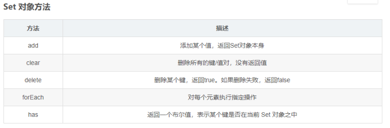

#### 1、对Js函数式编程的理解？

​	(1) "函数式编程"是一种 "编程范式" ,它属于["结构化编程"](http://en.wikipedia.org/wiki/Structured_programming)的一种，主要思想是把运算过程尽量写成一系列嵌套的函数调用。

​	(2) 函数式编程的一个特点就是，允许把函数本身作为参数传入另一个函数，还允许返回一个函数！

​	(3) 通过定义不同功能的函数，可以模块化代码，实现函数功能的复用，降低代码的耦合性，有利于合作开发代码；由于函数式编程大量使用函数，减少代码的重复，因此程序比较短，开发比较快；

 （4）函数式编程不需要考虑"死锁"，因为它不修改变量，所以根本不存在"锁"线程的问题。不必担心一个线程的数据，被另一个线程修改；

​	 https://www.ruanyifeng.com/blog/2012/04/functional_programming.html

#### 2、你是怎样使用Vue脚手架搭建前端项目的？

我说了vue init webpack project_Name,问我为什么不用Vue原生的工具Vue-cli（感觉需要去了解一下）

#### 3、JS中常见的数据类型有哪些？

**七种基本数据类型：**

​		number、null、undefined、boolean、string、Symbol(ES6)、BigInt

**引用类型有：**

​		对象（Object）、数组（Array）、函数（Function）、Date

​	1、null：会被转换成0，表示此处没有对象不应该有值

​			典型用法：如原型链最顶端

​	2、undefined：转为NAN，此处应该有一个值但是还没有定义。

​			典型用法：如变量被声明了但是没有赋值

**typeof：**

- typeof XXX 返回的都是字符串类型，如 ‘object’;

- typeof可以判断的基本数据类型：

​			number、undefined、boolean、string、Symbol

- 可以识别 function
- 能判断是否是引用类型（但不可再细分）：object（注意：typeof null === 'object'、typeof  array === 'object'、typeof Object === 'object'）

**instanceof：**

​	instanceof返回的结果是一个布尔值，true或者false。通常用于用于检测引用类型。如：‘abc’ instanceof String。

**instanceof能识别哪些类型：**

- Array

- Function

- Object

- 注意：XXX instanceof Object，如果XXX是Array或者Function，则返回的值是true

#### 4、Vue为什么能够实现URL变化时重新刷新界面，但是不重新从后台获取数据？

我觉得考的是Vue-Router,所以回答了 hash模式 、history模式这些。

**理解：**

​	前端不同页面的状态管理器，可以不向后台发送请求而直接通过前端技术实现多个页面的切换。

hash模式：

​	通过锚点定位原理进行无刷新跳转，触发后会在url后面多加一个#号

history模式：

​	使用HTML5中的historyAPI实现客户端路由模式，触发后url中没有#

#### 5、ES6中有哪些新加的语法？

**1、函数继承上的区别**

（1）ES5的继承

​		ES5的继承实质上是先创建子类的实例对象，然后再将父类的方法添加到this上（Parent.apply(this)），然后再把原型链继承。

**构造函数继承**：

```javascript
function Parent() {
    this.name = 'parent';
}
Parent.prototype.say = function () {
    console.log('say');
};
function Child(age) {
    Parent.call(this);
    this.age = age;
}
var p = new Parent(); //new一个Parent对象用来对比
p.say(); //输出say
var c = new Child(12);
c.age // 12
c.name //'parent'
c.say(); //undifined
/*
say是Parent原型链上的方法，Parent对象调用方法时，如果自身不存在就回去原型链上寻找，在原型链上找到了say方法，而Child对象没有继承Parent对象的原型链，所以它在向上寻找时就找不到，输出undifined。
*/
```

 **原型链继承：**

```javascript
function Parent() {
    this.name = 'parent';
}
Parent.prototype.say = function () {
    console.log('say');
};
function Child(age) {
    this.age = age;
}
Child.prototype = new Parent();
var c = new Child(12);
console.log(c.name); //输出parent
c.say() //输出say
/*
原型链继承是直接让Child构造函数的prototype直接指向Parent对象，这样Parent的东西Child对象可以直接从它的原型链上找到。缺点就是：当创建多个实例时，如果不同实例可能互相存在影响。
*/
```

**构造函数与原型链组合继承**：

```javascript
function Parent() {
    this.name = 'parent';
    this.arr = [1,2,3,4]
}
Parent.prototype.say = function () {
    console.log('say');
};
function Child(age) {
    Parent.call(this); 
    this.age = age;
}
Child.prototype = new Parent();
Child.prototype.constructor = Child;
var c1 = new Child(12);
var c2 = new Child(12);
console.log(c1.arr); //[1,2,3,4]
console.log(c2.arr);//[1,2,3,4]
c1.arr.push(5);
console.log(c1.arr); //[1,2,3,4,5]
console.log(c2.arr); //[1,2,3,4]
```

（2）ES6的继承

​		ES6的继承机制完全不同，实质上是先创建父类的实例对象this（所以必须先调用父类的super()方法，才可使用this关键字，否则报错。），然后再用子类的构造函数修改this实现继承。

```javascript
class Parent2 {
    constructor() {
        this.name = 'parent';
    }
}
Parent2.prototype.say = function () {
    console.log('say');
};
class Child2 extends Parent {
    constructor(age) {
        super();
        this.age = age;
    }
}
var c2 = new Child2(12);
console.log(c2.name); //输出parent
c2.say(); //输出say
console.log(c.constructor); 
//输出function Child(age) {Parent.call(this);this.age = age;}
console.log(new Parent().constructor); 
//输出Parent() {this.name = 'parent';this.arr = [1,2,3,4];}
```

（3）圣杯模式

​	圣杯模式的本质在于，中间生成了一个对象，起到了隔离的作用，今后为Son.prototype添加属性时，全部都会加在这个对象里面,所以不会对父级产生影响。而向上查找是沿着__proto__查找，可以顺利查找到父级的属性，实现继承。

```javascript
function Father(){}
function Son(){}   Father.prototype.lastName=‘Jack‘;
	//圣杯模式
function inherit(Target,Origin){
        function F(){};
        F.prototype = Origin.prototype;
        Target.prototype=new F();
}
inherit(Son,Father);
var son=new Son();
var father=new Father(); 
Son.prototype.sex=‘male‘;   
console.log(son.lastName);//Jack
console.log(son.sex);//male
console.log(father.sex);//undefined
```

**2、作用域的区别**

\* ES5中的作用域有---全局作用域、函数作用域

\* ES6中新增了---块级作用域（块级作用域由{}包裹，if语句、for语句中的{}也属于块级作用域）

**var：**

1. 没有块级作用域的概念
2. 有全局作用域、函数作用域的概念
3. 不初始化值默认为undefined
4. 存在变量提升
5. 全局作用域用var声明的变量会挂载到window对象下
6. 同一作用域中允许重复声明

**let：**

1. 有块级作用域的概念
2. 不存在变量提升
3. 暂时性死区

在块级作用域中，使用let命令声明变量之前，该变量都是不可用的。这在语法上，称为“暂时性死区”（temporal dead zone，简称 TDZ）。

1. 不存在全局作用域的概念
2. 同一块作用域中不允许重复声明

**const:** 

1. 与let特性一样，仅有2个差别
2. 区别1——必须立即初始化，不能留到以后赋值
3. 区别2——常量的值不能改变

参考：https://www.cnblogs.com/liu-di/p/11889683.html

**3、promise**

**4、箭头函数**

**5、数组中的展开运算符**

**6、set的属性方法**

​	Set对象是值的集合，Set 中的元素是唯一的，Set 对象允许你存储任何类型的唯一值，无论是原始值或者是对象引用。



#### 6、你对Nodejs了解多少，Nodejs有哪些后台框架？你用过哪些？

#### 7、JS中的深拷贝和浅拷贝的区别？

​	浅拷贝只复制指向某个对象的指针，而不复制对象本身，新旧对象还是共享同一块内存。但是深拷贝会另外创造一个一模一样的对象，新对象跟原对象不共享内存，修改新对象不会改到原对象。

**浅拷贝的实现方法：**

​	1、简单地赋值语句

​	2、Object.assign(target,....source)	（是ES6中的新语法，返回目标对象）

​	3、js中数组和对象自带的拷贝方法，contact、slice、...展开运算符

**深拷贝的实现方法：**

​	1、手动复制：把对象的属性赋值给另一个对象的属性

​	2、对象只有一层的话可以使用Object.assign({},obj1)

​	3、使用Object.create()  : var newObj = Object.create(oldObj)

​	4、jquery中使用$.extend

​	5、loadsh中使用_.cloneDeep

**递归实现深拷贝：**

```javascript
function deepClone(obj = {}){
    if(typeof obj !== 'object' || obj ==null){
        return obj;
    }
    let result;
    if(obj instanceof Array){
        result = [];
    }else{
        result = {};
    }
    for(let key in obj){
        if(obj.hasOwnProperty(key)){
            result[key] = deepClone(obj[key]); 
        }
    }
    return result;
}
```

#### 8、Webpack的常见配置项有哪些？

​	**1、Entry:**

​		入口(Entry)指示 webpack 以哪个文件为入口起点开始打包，分析构建内部依赖图。

​	**2、Output:**

​		输出(Output)指示 webpack 打包后的资源 bundles 输出到哪里去，以及如何命名。

​	**3、Loader:**

​		Loader 让 webpack 能 够 去 处 理 那 些 非 JavaScript 文 件 (webpack 自 身 只 理 解JavaScript)

​	**4、Plugins：**

​		插件(Plugins)可以用于执行范围更广的任务。插件的范围包括，从打包优化和压缩，一直到重新定义环境中的变量等。

​	**5、Mode：**

​		模式(Mode)指示 webpack 使用相应模式的配置。在DefinePlugin中的process.env.NODE_ENV中设置

​		1、development 开发模式

​				能让代码本地调试

​		2、production 生产模式

​				能让代码优化上线

```javascript
//webpack.config.js webpack的配置文件
/*
    作用：指示webpack干哪些活（当你运行webpack指令时，会加载里面的配置）
    所有构建工具都是基于node.js平台运行的~模块化采用commonjs
*/
const {resolve} = require('path') //用来拼接绝对路径
const HtmlWebpackPlugin = require('html-webpack-plugin');
module.exports = {
    entry:'./src/index.js',
    output:{
        filename:'built.js'
        path:'resolve(__dirname,'build')'//__dirname 代表当前文件目录的绝对路径
    },
    //loader的配置
    module:{
        rules:[
            {
                //匹配哪些文件
                test:/\.css$/,
                //使用哪些loader进行处理
                use:[
                    //创建style标签，将js中的样式资源插入进行，添加到head中生效
                    'style-loader',
                    //将css文件变成commonjs模块加载js中，里面内容是样式字符串
                    'css-loader'
                ]
            },
            {
                test:/\.less$/,
                use:[
                     'style-loader',
                     'css-loader',
                     'less-loader'
                ]
            },
            {
                //处理不了html中的img
                test:/\.(jpg|png|gif)$/,
                loader:'url-loader',
                option:{
                    //图片大小为8kb,就会被base64处理
                    //优点：减少请求数量（减轻服务器压力）
                    //缺点：图片体积会更大（文件请求更慢）
                    limit:8*1024,
                    //问题：因为url-loader默认使用es6模块解析，而html-loader引入图片是
                    //commonjs,解析时会出问题
                    esModule:false
                }
            },
            {
                test:/\.html$/,
                //处理HTML文件的img图片（负责引入img,从而能被url-loader进行处理）
                loader:'html-loader',
            }
        ]
    },
    plugins:[
        //默认会创建一个空的HTML,引入打包输出的所有资源（JS/CSS）
        new HtmlWebpackPlugin({
            //复制‘./src/index.html’文件，并自动引入打包输出的所有资源（JS/CSS）
            template:'./src/index.html'
        })
    ],
    mode:'development',
    devServer:{ //开发模式时使用，打包上线就不需要了
      port:3000,
      contentBase:path.join(__dirname,'dist')  
    },
}
```

#### 9、常见的状态码有哪些？

​	1.HTTP状态码的职责：

​		当客户端向服务器端发送HTTP请求后，用于描述服务器端返回的请求结果。

​	2.HTTP状态码的分类：

​		（1）1xx 信息性状态码

​		（2）2xx 成功状态码

​		（3）3xx 重定向状态码

​		（4）4xx 客户端错误状态码

​		（5）5xx 服务器端错误状态码

​	3.常用的状态码：

​	（0） 100-199 信息提示状态码，表示正在处理

​	（1）200 OK 请求响应成功

​	（2）204 请求响应成功，但没内容返回

​	（3）206 处理部分请求成功

​	（4）301 永久性重定向

​	（5）302 临时性重定向

​	（6）303 临时性重定向，要求client采用git方法请求资源。

​	（7）304 Not modified 资源未更新，使用缓存资源

​	（8）307 临时性重定向，不会将post改成git。

​	（9）400 Bad Request 客户端请求错误，服务器无法处理请求

​	（10）401 Unauthorized 客户端请求未认证

​	（11）403 Forbidden 禁止客户端请求

​	（12）404 Not Found 资源未找到

​	（13）500 Internal Server Error 服务器内部错误

​	（14）501 Not Implemented 服务器不支持请求的功能，无法完成请求

​	（15）502 Bad Gateway 网关错误

​	（16）503 Server Unavailable 服务器服务不可用

​	（17）504 Gateway Time-out	未及时从远端服务器获取请求

​	（18） 505 HTTP Version not supported 服务器不支持http协议版本，无法完成处理

#### 10、JS中new一个对象的过程？

​	1、先创建一个空对象

​		var obj = new Object();

​	2、让函数的中的this指向这个对象，并执行函数

​		var reslut = Person.call(obj)

​	3、设置原型链，让新建对象的__proto__ 指向函数的Prototype成员对象

​		obj.__proto__ = Person.prototype

​	4、判断函数的返回类型，如果是值类型就返回obj，如果是引用类型，就返回引用类型的对象

#### 11、你对http2.0的了解，http1.0和http2.0有什么区别？

1、影响一个 HTTP 网络请求的因素主要有两个：**带宽和延迟。**

- **带宽：**如果说我们还停留在拨号上网的阶段，带宽可能会成为一个比较严重影响请求的问题，但是现在网络基础建设已经使得带宽得到极大的提升，我们不再会担心由带宽而影响网速，那么就只剩下延迟了。
- **延迟：**

（1）浏览器阻塞（HOL blocking）：浏览器会因为一些原因阻塞请求。浏览器对于同一个域名，同时只能有 4 个连接（这个根据浏览器内核不同可能会有所差异），超过浏览器最大连接数限制，后续请求就会被阻塞。

（2）DNS 查询（DNS Lookup）：浏览器需要知道目标服务器的 IP 才能建立连接。将域名解析为 IP 的这个系统就是 DNS。这个通常可以利用DNS缓存结果来达到减少这个时间的目的。

（3）建立连接（Initial connection）：HTTP 是基于 TCP 协议的，浏览器最快也要在第三次握手时才能捎带 HTTP 请求报文，达到真正的建立连接，但是这些连接无法复用会导致每次请求都经历三次握手和慢启动。三次握手在高延迟的场景下影响较明显，慢启动则对文件类大请求影响较大。

2、http2.0和http1.x相比的新特性

**（1）**http1.x 的解析是基于文本的，格式解析存在缺陷。http2.0的协议解析是基于二进制格式，实现方便且健壮。

**（2）**多路复用（MultiPlexing），即连接共享，即每一个request都是是用作连接共享机制的。一个request对应一个id，这样一个连接上可以有多个request，每个连接的request可以随机的混杂在一起，接收方可以根据request的 id将request再归属到各自不同的服务端请求里面。

**（3）**header压缩，HTTP1.x的header带有大量信息，而且每次都要重复发送，HTTP2.0使用encoder来减少需要传输的header大小，通讯双方各自cache一份header fields表，既避免了重复header的传输，又减小了需要传输的大小。

**（4）**服务端推送（server push），同SPDY一样，HTTP2.0也具有server push功能。

HTTP1.0：

（1）请求与响应支持HTTP头，响应含状态行，增加状态码；

（2）支持HEAD，POST方法

（3）支持HTML文件以外其他类型的内容

（4）非持久连接，客户端必须为每一个待请求的对象建立并维护一个新的连接

HTTP1.1

（1）支持长连接

（2）在Http1.0的基础上引入了更多的缓存控制策略；

（3）引入请求范围设置，优化了带宽；

  (4)  在错误通知管理中新增了错误状态响应码；

  (5)  增加了Host头处理，可以传递主机名；

缺点：传输内容是明文，不够安全；

HTTP2.0：

（1）二进制分帧

（2）多路复用（或连接共享）

（3）头部压缩

（4）服务器推送（Sever push）

HTTP3.0：

（1）基于UDP实现，可实现切换网络时保持连接

（2）0 RTT建连

（3）基于UDP的多路复用，实现无阻塞的多路复用（2.0是会阻塞的）

（4）加密认证的报文

（5）向前纠错机制

RTT(Round Trip Time)：一个连接的往返时间，即数据发送时刻到接收到确认的时刻的差值；

参考文献：https://www.cnblogs.com/heluan/p/8620312.html

https://blog.csdn.net/glpghz/article/details/106063833

#### 12、Vue中几种常见的组件间的通信方式？ (特地问了我eventBus)

​	**组件间的通信原则：**

​		（1）不要在子组件中直接修改父组件的状态数据

​		（2）数据在哪，更新数据的行为（函数）就应该在哪

​	**组件中的通信方式：**

1、通过标签使用props

```javascript
<template>
	<List :comments="comments"/>
</template>
export default{
	//声明接收属性：这个属性就会成为组件接收属性。
	props:['comments'] //只指定属性名
    props:{//指定属性名和属性值的类型
    	comment:Object
    }
    //传过来的属性是函数的情况
	props:{
         addComment{//函数名
        	type:Function,
        	required:ture
          }
    }
}
```

2、通过Vue的自定义事件

​	(1)绑定事件监听

```javascript
//方式一：通过v-on绑定
@delete_todo="deleteTodo"
//触发自定义事件：addTodo
this.$emit('addTodo',todo)
**多用于单层父子之间的传递

//方式二：通过$on()
this.$refs.xxx.$on('delete_todo',function(todo){
	this.deleteTodo(todo)
})
```

​	(2)事件触发

```javascript
//触发事件（只能在父组件中接收）
this.$emit(eventName,data)
```

3、通过消息的订阅与发布使用PubsubJS库

```javascript
优点：此方式可实现任意关系组件间的通信（数据）
1）绑定事件监听（订阅消息）
  目标：标签元素<button>
  事件名（类型）：click/focus
  回调函数：function(event){}
2）触发事件（发布消息）
  DOM事件：用户在浏览器上对应的界面上做对应的操作
  自定义：编码手动触发
实现步骤：
  1、给要绑定的监听的标签赋ref值
	<button ref="deleteTodo"></button>
  2、在mounted:{}里面写异步代码
    //订阅消息
    PubSub.subscribe('deleteTodo',(msg,data)=>{
        this.deleteTodo(index)
    })
  3、在另一个组件（子组件）中写发布方法
    PubSub.publish('deleteTodo',index)
  备注：该步骤是把子组件中的deleteTodo函数中的index传给父组件
```

4、通过使用插槽slot

```javascript
<template> 
  <div>
    <slot name="xxx">不确定的标签结构 1</slot> 
    <div>组件确定的标签结构</div> 
    <slot name="yyy">不确定的标签结构 2</slot> 
  </div> 
</template>
<child>
   <div slot="xxx">xxx 对应的标签结构</div> 
  <div slot="yyy">yyyy 对应的标签结构</div> 
</child>
```

5、使用eventBus

发送事件

```javascript
<!-- DecreaseCount.vue -->
<template>
    <button @click="decrease()">-</button>
</template>
<script> 
    import { EventBus } from "../event-bus.js";
    export default {
        name: "DecreaseCount",
        data() {
            return {
                num: 1,
                deg:180
            };
        },
        methods: {
            decrease() {
                EventBus.$emit("decreased", {
                    num:this.num,
                    deg:this.deg
                });
            }
        }
    }; 
</script>
<!-- IncrementCount.vue -->
<template>
    <button @click="increment()">+</button>
</template>
<script> import { EventBus } from "../event-bus.js";
    export default {
        name: "IncrementCount",
        data() {
            return {
                num: 1,
                deg:180
            };
        },
        methods: {
            increment() {
                EventBus.$emit("incremented", {
                    num:this.num,
                    deg:this.deg
                });
            }
        }
    };
 </script>
```

接收事件

```javascript
<!-- App.vue -->
<template>
    <div id="app">
        <div class="container" :style="{transform: 'rotateY(' + degValue + 'deg)'}">
            <div class="front">
                <div class="increment">
                    <IncrementCount />
                </div>
                <div class="show-front"> {{fontCount}} </div>
                <div class="decrement">
                    <DecreaseCount />
                </div>
            </div>
            <div class="back">
                <div class="increment">
                    <IncrementCount />
                </div>
                <div class="show-back"> {{backCount}} </div>
                <div class="decrement">
                    <DecreaseCount />
                </div>
            </div> 
        </div>
    </div>
</template>
<script>
    import IncrementCount from "./components/IncrementCount";
    import DecreaseCount from "./components/DecreaseCount";
    import { EventBus } from "./event-bus.js";
    export default {
        name: "App",
        components: {
            IncrementCount,
            DecreaseCount
        },
        data() {
            return {
                degValue:0,
                fontCount:0,
                backCount:0
            };
        },
        mounted() {
            EventBus.$on("incremented", ({num,deg}) => {
                this.fontCount += num
                this.$nextTick(()=>{
                    this.backCount += num
                    this.degValue += deg;
                })
            });
            EventBus.$on("decreased", ({num,deg}) => {
                this.fontCount -= num
                this.$nextTick(()=>{
                    this.backCount -= num
                    this.degValue -= deg;
                })
            });
        }
    }; 
</script>
```

6、使用Vuex

#### 13、懒加载

1、懒加载就是在加载内容时按需加载，是一种很好的优化网页或者应用的方法。

2、原理：先把你的代码在一些逻辑断点处分离开，然后在一些代码块中完成某些操作后，立即或即将引用另外一些新的代码。

3、作用：因为这样做了以后某些代码块可能永远不会被加载，所以加快了应用的初始加载速度，减轻了它的总体体积。

**（1）图片的懒加载**

​	先将img标签的src连接设置为同一张白色图片，然后给img标签设置自定义属性，然后将真正的图片存储在属性中，当js监听到该图片元素进入可视窗口时，将自定义属性中的地址传输到src属性中，达到懒加载的效果。这样做防止页面一次向服务器发送大量请求，导致页面响应慢，页面卡顿。

**（2）懒加载在Vue或Webpack中实现**

​	在单页面应用中，如果没有应用懒加载，运用webpack打包后的文件将会异常的大，造成进入首页时，需要加载的内容过多，延时过长不利于用户体验，而运用懒加载则可以将页面进行划分，需要的时候加载页面，可以有效的分担首页所承担的加载压力，减少首页加载用时。

1、与webpack配合实现组件懒加载

​	在Webpack中配置文件中的output路径配置chunkFilename属性，chunkFilename路径将会作为组件懒加载的路径

```javascript
output: {
        path: resolve(__dirname, 'dist'),
        filename: options.dev ? '[name].js' : '[name].js?[chunkhash]',
        chunkFilename: 'chunk[id].js?[chunkhash]',
        publicPath: options.dev ? '/assets/' : publicPath
},
```

2、在路由中配置异步组件

```javascript
export default new Router({
    routes: [
        {
            mode: 'history',
            path: '/my',
            name: 'my',
            component:  resolve => require(['../page/my/my.vue'], resolve),//懒加载
        },
    ]
})
```

3、在实例中配置异步组件

```javascript
components: {
        historyTab: 
            resolve => {
                require(['../../component/historyTab/historyTab.vue'], resolve)
            },//懒加载
        //historyTab: () => import('../../component/historyTab/historyTab.vue')
},
```

4、全局注册异步组件

```javascript
Vue.component('mideaHeader', () => {
    System.import('./component/header/header.vue')
})
```

**（3）懒加载的最终实现方案**

1、路由页面以及路由页面中的组件全部使用懒加载

​	**优点：**

​		（1）最大化实现随用随载

​		（2）团队开发不会因为沟通问题造成资源的重复浪费

​	**缺点：**

​		（1）当一个页面中嵌套多个组件时将发送多次的http请求，可能会造成网页显示过慢且渲染参差不齐的问题。

2、路由页面使用懒加载，而路由页面中的组件按需进行懒加载，即如果组件不大且使用不太频繁，直接在路由页面中导入组件，如果组件使用较为频繁使用懒加载。

​	**优点：**

​		（1）能够减少页面中的http请求，页面显示效果好

​	**缺点：**

​		（2）需要团队事先交流， 在框架中分别建立懒加载组件与非懒加载组件文件夹。

3、路由页面使用懒加载，在不特别影响首页显示延迟的情况下，根页面合理导入复用组件，再结合方案2

​	**优点：**

​		（1）合理解决首页延迟显示问题

​		（2）能够最大化的减少http请求， 且做其他他路由界面的显示效果最佳

​	**缺点：**

​		（1）还是需要团队交流，建立合理区分各种加载方式的组件文件夹

#### 14、问题：说在Vue脚手架中你有很多路由，然后路由又有子路由，那么请问你在程序打包的时候要怎么优化它

​		我感觉就是在问懒加载在vue路由中的作用。

#### 15、如何改变this的指向，有多少种方法。

**1、call()和apply()**

​	**call():**第一个参数表示要把this指向的新目标，第二个之后的参数其实相当于传参，参数以逗号隔开（性能较apply略好）。

​	用法：a.call(b,1,2)；表示要把a函数的this指向修改为b的this指向，并运行a函数，传入参数是（1,2）

​	**apply()：**第一个参数同上，第二个参数接收一个数组，里面也是传参，只是以数组的方式，相当于arguments

用法：a.apply(b,[1,2])；表示要把a函数的this指向修改为b的this指向，并运行a函数，传进去的参数是(1,2);

***注意：即使只有一个参数的话，也要是数组的形式**

```javascript
//call 的传参和apply的传参
function say(arg1,arg2){
  console.log(this.name,arg1,arg2);
};
var obj = {
  name : 'tom',
  say : function(){
    console.log(this.name);
  }
}
say.call(obj,'one','two');//tom one two
say.spply(obj,['one','two']);//tom one two  效果一样
```

**2、bind()**

​	作用：bind()方法会创建一个新的函数，称为绑定函数，当调用这个绑定函数时，绑定函数会以创建它时传入bind()方法的第一个参数作为this，传入bind()的第二个及以后的参数加上绑定函数运行时本身的参数按照顺序作为原函数的参数来调用原函数。

​	用法：

```javascript
var foo = {
    bar : 1,
    eventBind: function(){
        $('.someClass').on('click',function(event) {
            /* Act on the event */
            console.log(this.bar);      //1
        }.bind(this));//这里的this是eventBind的this，即指向的是foo
    }
}
```

bind 是返回对应函数，便于稍后调用；apply 、call 则是立即调用 。

**3、new**

new的运行原理：

```javascript
new Animal('cat') = {//类似这样
    var obj = {};//先定义一个空对象
    obj.__proto__ = Animal.prototype;
    //把 obj 的__proto__ 指向构造函数 Animal 的原型对象 prototype，
    //此时便建立了 obj 对象的原型链：
    //obj->Animal.prototype->Object.prototype->null
    var result = Animal.call(obj,"cat");//改变this指向，从Animal改变到obj上
    return typeof result === 'object'? result : obj; //返回
}
```

用法：

```javascript
function Fn(){
    this.user = "追梦子";
}
var a = new Fn();//this指向a
console.log(a.user); //追梦子
```

**4、return**

​	在构造函数的时候，使用return进行返回一个Object的时候，当去new一个实例对象的时候，会将this指向改变为return的Object；

​	 用法：

```javascript
function fn()  
{  
    this.user = '追梦子';  
    return {
        "user" : "111"
    };  
}
var a = new fn;  
console.log(a.user); //111
```

